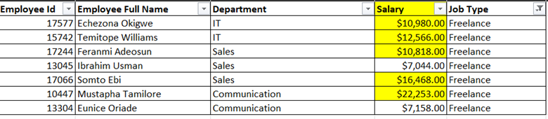
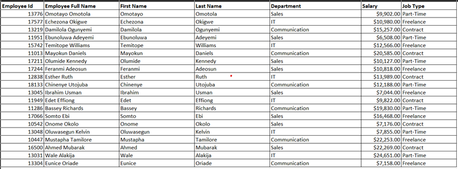
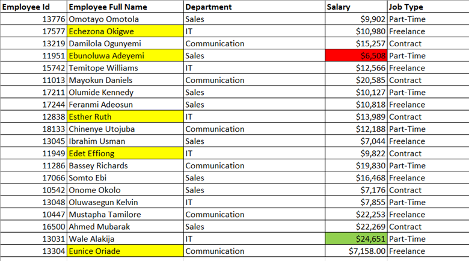
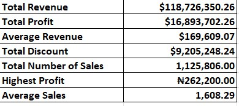
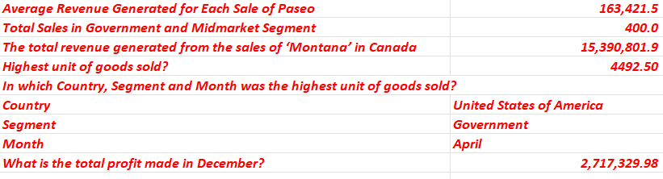

# Excel Sales Data Analysis

## Introduction
This is an assignment as part of a **Data Analysis Bootcamp facilitated by Promise Chinonso and Victor Somadina**. The data worked on is an imaginary data set on Sales for an organization

## Tasks
### For Task 1
I was required to;
1. Show only employees who are ‘Freelancers’ and highlight the ones whose salaries are above $10000.
2. Split the employees’ full names into first names and last names.
3. Check for duplicates and highlight if any (do not delete).
4. Highlight employees whose names begin with the letter ‘E’ (in yellow). Format the Salary column such that the highest SALARY has a green background and the lowest SALARY has a red background.
Below are screenshots of the results for task 1

### For Task 2
Using the same Sales Data, I was able to determine the following;
1. The total Revenue and Profit generated.
2. The average Revenue and Units Sold for every order.
3. The total Discount is given in $.
a4. Total number of sales recorded.
5. The highest Profit generated.
Create a column named ‘Sales Range’, and return ‘High Sales’ if the Sales value is above average, otherwise, return ‘Low Sales’.

### For Task 3
I used the Sales Data to calculate:
1. The average revenue generated from each sale of ‘Paseo’
2. The number of sales made in the Government and Midmarket segment
3. The total revenue generated from the sales of ‘Montana’ in Canada
4. In which Country, Segment, and Month was the highest unit of goods sold?
5. What is the total profit made in December?

